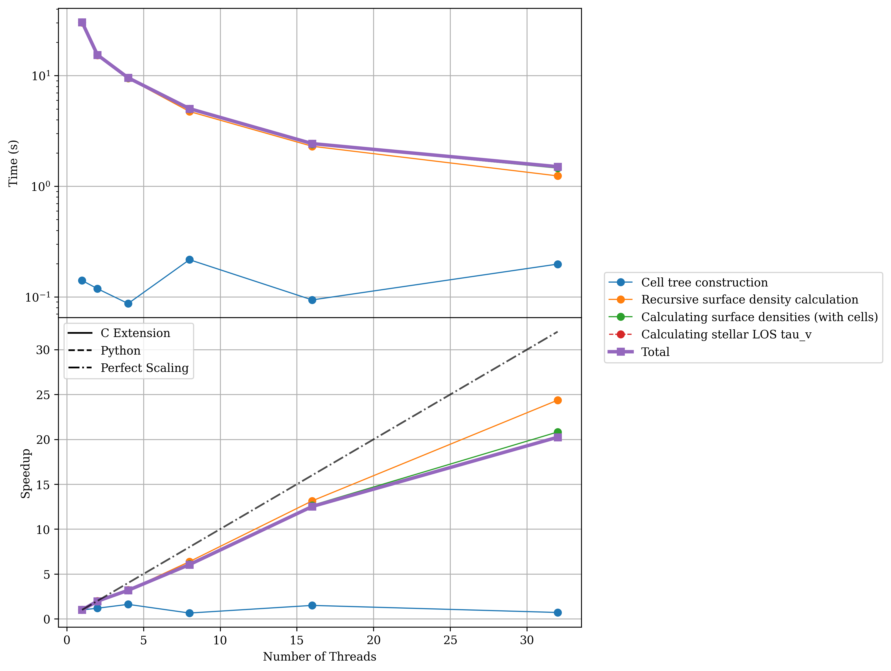

Performance 
=========== 

To ensure Synthesizer is performant enough to handle the large dynamic range of possible input datasets we have put a lot of effort into optimising the codebase. 
Needless to say, we are always looking for ways to improve performance further, so if you have any suggestions or find any bottlenecks, please do not hesitate to open an issue on GitHub.
We have implemented a number of performance optimisations, including:

- Using C++ extensions for computationally intensive tasks.
- Using OpenMP for shared memory parallelism to avoid the GIL bottleneck in Python. 
- Reducing memory allocations and copies as much as possible (including removing copies inherent during ``unyt`` conversion operations). 

We detail the OpenMP parallelism model we have implemented in the codebase in the section linked below.

.. toctree::
   :maxdepth: 1

   openmp

Profiling 
~~~~~~~~~ 

To ensure the code remains performant, we have a bespoke profilling suite we maintain (and plan to expand) to test the performance of the codebase. 
This can be found in the ``profiling`` direcotory of the repository. 
In the following sections we show some performance benchmarks to give an idea of the performance of the codebase. All these tests were run on the Cosma8 HPC at Durham University. The output of the ``lscpu`` and ``numactl --hardware`` commands are shown below to give an idea of the hardware used for these tests.

.. code-block:: none

    Architecture:             x86_64
      CPU op-mode(s):         32-bit, 64-bit
      Address sizes:          43 bits physical, 48 bits virtual
      Byte Order:             Little Endian
    CPU(s):                   128
      On-line CPU(s) list:    0-127
    Vendor ID:                AuthenticAMD
      Model name:             AMD EPYC 7542 32-Core Processor
        CPU family:           23
        Model:                49
        Thread(s) per core:   2
        Core(s) per socket:   32
        Socket(s):            2

    Caches (sum of all):
      L1d:                    2 MiB (64 instances)
      L1i:                    2 MiB (64 instances)
      L2:                     32 MiB (64 instances)
      L3:                     256 MiB (16 instances)

.. code-block:: none 

available: 2 nodes (0-1)
node 0 cpus: 0 1 2 3 4 5 6 7 8 9 10 11 12 13 14 15 16 17 18 19 20 21 22 23 24 25 26 27 28 29 30 31 64 65 66 67 68 69 70 71 72 73 74 75 76 77 78 79 80 81 82 83 84 85 86 87 88 89 90 91 92 93 94 95
node 0 size: 1019611 MB
node 0 free: 519591 MB
node 1 cpus: 32 33 34 35 36 37 38 39 40 41 42 43 44 45 46 47 48 49 50 51 52 53 54 55 56 57 58 59 60 61 62 63 96 97 98 99 100 101 102 103 104 105 106 107 108 109 110 111 112 113 114 115 116 117 118 119 120 121 122 123 124 125 126 127
node 1 size: 1032127 MB
node 1 free: 130805 MB
node distances:
node     0    1
   0:   10   32
   1:   32   10

Scaling Performance
^^^^^^^^^^^^^^^^^^^

The performance of the code will scale with the number of threads used, up to the number of physical cores on your machine. In this section, we show some scaling tests focused on performance intensive tasks in Synthesizer. 

Each of these plots shows the time to solution vs the number of threads in the top panel, and the speedup vs the number of threads in the bottom panel. Each line shows a timed operations in the codebase (i.e. a code block or function surrounded by a ``tic`` and a ``toc``). For further details on each line you can grep through the codebase for the legend key to see the code block that was timed.

Integrated Spectra Scaling 
-------------------------- 

Here we calculate the integrated spectra for a galaxy with 1 million star particles sampled from a constant Star Formation History and normally distributed metallicities. 

.. code-block:: python 

   param_stars = ParametricStars(
        grid.log10ages,
        grid.metallicities,
        sf_hist=SFH.Constant(100 * Myr),
        metal_dist=ZDist.Normal(0.005, 0.01),
        initial_mass=10**10 * Msun,
    ) 

This scaling test was run with the following command.

.. code-block:: bash 

    python strong_scaling_int_spectra.py --basename docs --nstars 1000000 --max_threads=32 --average_over 10 --low_thresh 0.01

.. image:: plots/docs_int_spectra_cic_totThreads32_nstars1000000.png
    :width: 75%
    :align: center 

Here we can see a reasonable scaling until thread we reach a certain number and the performance starts to plateau. This is due to the overhead in managing the threads and reduction onto the final spectra array. Further improvements to the codebase may improve this scaling further, but its worth nothing the diminishing returns and designing partitioning schemes around this.

Particle Spectra Scaling 
------------------------

Here we calculate the particle spectra for a galaxy with 100,000 star particles sampled from a constant Star Formation Hisotry and normally distributed metallicities. 

.. code-block:: python 

   param_stars = ParametricStars(
        grid.log10ages,
        grid.metallicities,
        sf_hist=SFH.Constant(100 * Myr),
        metal_dist=ZDist.Normal(0.005, 0.01),
        initial_mass=10**10 * Msun,
    )

This scaling test was run with the following command.

.. code-block:: bash

    python strong_scaling_part_spectra.py --basename docs --nstars 100000 --max_threads=32 --average_over 10 --low_thresh 0.01

.. image:: plots/docs_part_spectra_cic_totThreads32_nstars100000.png
   :width: 75%
   :align: center

Unlike the integrated spectra scaling, the particle spectra falls foul of cache misses and memory bandwidth limitations. The point of dimishing returns is much smaller here (<16 threads) but we further improvements are absolutely possible and in the works. 

Line-Of-Sight (LOS) Column Density Scaling 
------------------------------------------

Here we calculate the LOS column density of gas metallicity for each star particle in a galaxy with 1 million star particles and 1 million gas particles. This scaling test was run with the following command.

.. code-block:: bash 

    python strong_scaling_los_col_den.py --basename docs --nstars 1000000 --ngas 1000000 --max_threads=32 --average_over 10 --low_thresh 0.01

   
The LOS column density scaling shows a much better scaling with only minimal diminishing returns as thread based overheads and reduction operations start to take their toll. Note that this scaling behaviour is also preserved for much smaller particle counts.

