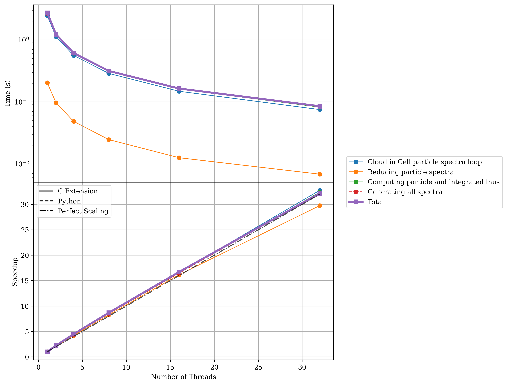

Performance 
=========== 

To ensure Synthesizer is performant enough to handle the large dynamic range of possible input datasets we have put a lot of effort into optimising the codebase. 
Needless to say, we are always looking for ways to improve performance further, so if you have any suggestions or find any bottlenecks, please do not hesitate to open an issue on GitHub.
We have implemented a number of performance optimisations, including:

- Using C++ extensions for computationally intensive tasks.
- Using OpenMP for shared memory parallelism to avoid the GIL bottleneck in Python. 
- Reducing memory allocations and copies as much as possible (including removing copies inherent during ``unyt`` conversion operations). 

We detail the OpenMP parallelism model we have implemented in the codebase in the section linked below.

.. toctree::
   :maxdepth: 1

   openmp

Profiling 
~~~~~~~~~ 

.. note::
    Before running the profiling suite, you will need to download the grids. See the `Downloading Grids <../getting_started/downloading_grids>`_ documentation for details.

To ensure the code remains performant, we have a bespoke profiling suite we maintain (and plan to expand) to test the performance of the codebase. 
This can be found in the ``profiling`` directory of the repository. 
In the following sections we show some performance benchmarks to give an idea of the performance of the codebase. All these tests were run on the Cosma8 HPC at Durham University. The output of the ``lscpu`` command is shown below, which gives an idea of the hardware used for these tests.

.. code-block:: 

    Architecture:             x86_64
      CPU op-mode(s):         32-bit, 64-bit
      Address sizes:          43 bits physical, 48 bits virtual
      Byte Order:             Little Endian
    CPU(s):                   128
      On-line CPU(s) list:    0-127
    Vendor ID:                AuthenticAMD
      Model name:             AMD EPYC 7542 32-Core Processor
        CPU family:           23
        Model:                49
        Thread(s) per core:   2
        Core(s) per socket:   32
        Socket(s):            2

Performance
^^^^^^^^^^^

The following sections show how Synthesizer performs as a function of the size of the problem (number of particles and number of wavelength elements). These benchmarks were run using 8 threads on a test machine.

Runtime Performance
-------------------

The following plots show the time taken to complete various operations as the problem size scales.

**Pipeline Scaling**

This plot shows the runtime of the full ``Pipeline`` object running all operations (LOS optical depths, SFZH/SFH, spectra, photometry, emission lines) in both rest-frame and observer-frame as a function of the number of stellar particles per galaxy (100 to 10,000 particles, 10 galaxies).

.. image:: plots/pipeline_timing_scaling.png
   :width: 75%
   :align: center

**Particle Scaling**

This plot shows how the runtime of spectra generation, photometry, and imaging scales with the number of stellar particles (from 10^3 to 10^5). These tests were run using a grid with 9244 wavelength elements. Imaging benchmarks include both smoothed and histogram-based methods at different pixel resolutions (100x100 and 1000x1000).

.. image:: plots/nparticles_performance_spectra_nlam9244_nt8.png
   :width: 75%
   :align: center

.. image:: plots/nparticles_performance_photometry_nlam9244_nt8.png
   :width: 75%
   :align: center

.. image:: plots/nparticles_performance_imaging_nlam9244_nt8.png
   :width: 75%
   :align: center

**Wavelength Scaling**

This plot shows the scaling of spectra generation runtime with the number of wavelength elements in the SPS grid (from 100 to 100,000 elements). These tests were run using a component with 10,000 particles.

.. image:: plots/wavelength_performance_spectra_npart10000_nt8.png
   :width: 75%
   :align: center

Memory Performance
------------------

The following plots show the memory footprint of the **results** of various operations. 

.. note::
   These plots measure the size of the final objects stored in memory (e.g., the generated spectra or photometry data). While these represent the permanent memory cost added to your session, there may be transient spikes in memory usage during the actual computation that are slightly higher than these values.

**Pipeline Scaling (Memory)**

This plot shows the memory usage (RSS sampling at 1kHz) of the full ``Pipeline`` execution across different particle counts. The memory footprint remains relatively constant as particle count increases, indicating efficient memory usage.

.. image:: plots/pipeline_memory_scaling.png
   :width: 75%
   :align: center

**Particle Scaling (Memory)**

This plot shows the memory size of the generated spectra and photometry objects as a function of the number of particles. 

.. image:: plots/nparticles_performance_memory_spectra_nlam9244_nt8.png
   :width: 75%
   :align: center

.. image:: plots/nparticles_performance_memory_photometry_nlam9244_nt8.png
   :width: 75%
   :align: center

**Wavelength Scaling (Memory)**

This plot shows the memory size of the generated spectra as a function of the number of wavelength elements in the grid.

.. image:: plots/wavelength_performance_memory_spectra_npart10000_nt8.png
   :width: 75%
   :align: center

Scaling Performance
^^^^^^^^^^^^^^^^^^^

The performance of the code will scale with the number of threads used, up to the number of physical cores on your machine. 

Integrated Spectra Scaling 
-------------------------- 

.. code-block:: bash 

    python strong_scaling_int_spectra.py --basename docs --nstars 1000000 --max_threads=32 --average_over 10 --low_thresh 0.01

.. image:: plots/docs_int_spectra_cic_totThreads32_nstars1000000.png
    :width: 75%
    :align: center 

Particle Spectra Scaling 
------------------------

.. code-block:: bash

    python strong_scaling_part_spectra.py --basename docs --nstars 10000 --max_threads=32 --average_over 10 --low_thresh 0.01

Line-Of-Sight (LOS) Column Density Scaling 
------------------------------------------

.. code-block:: bash 

    python strong_scaling_los_col_den.py --basename docs --nstars 1000000 --ngas 1000000 --max_threads=32 --average_over 10 --low_thresh 0.01

.. image:: plots/docs_los_column_density_totThreads32_nstars1000000_ngas1000000.png
   :width: 75%
   :align: center 

Smoothed Imaging Scaling
------------------------

.. code-block:: bash 

    python strong_scaling_images.py --basename docs --nstars 1000r --max_threads=32 --average_over 10 --low_thresh 0.01

.. image:: plots/test_images_totThreads32_nstars10000.png
   :width: 75%
   :align: center

