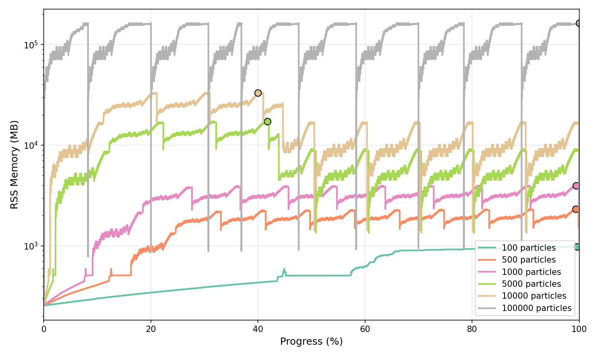

Pipeline Profiling
==================

These benchmarks represent "real-world" usage patterns where multiple operations are performed in sequence using the ``Pipeline`` object. This tests how the full pipeline scales with problem size when performing all typical analysis tasks together.

Test Configuration
------------------

The Pipeline profiling uses the following configuration to represent realistic observational analysis workflows:

.. list-table::
   :widths: 30 70
   :header-rows: 0

   * - **Emission Model**
     - ``PacmanEmission`` with dust attenuation (tau_v=0.5, fesc=0.1)
   * - **Instrument**
     - JWST NIRCam Wide with 8 filters (F070W, F090W, F115W, F150W, F200W, F277W, F356W, F444W)
   * - **Imaging**
     - 60 kpc field of view at z=1.0 with angular resolution (0.031 arcsec/pixel)
   * - **Operations Performed**
     - LOS optical depths, SFZH/SFH (star formation history), rest-frame spectra (Lnu), observer-frame spectra (Fnu), photometry luminosities, photometry fluxes, emission line luminosities, emission line fluxes, rest-frame images, observer-frame images
   * - **Galaxies**
     - 10 synthetic galaxies per run, each containing stars, gas, and black holes
   * - **Particle Counts**
     - 100, 500, 1000, 5000, 10000
   * - **Hardware**
     - AMD EPYC 7542 32-Core Processor, 8 threads used

Timing Performance
------------------

The following plot shows how the Pipeline runtime scales with the number of stellar particles per galaxy. Only operations contributing ≥5% to the total runtime in at least one particle count are shown. The O(n) reference line is anchored at the first data point (100 particles).

.. image:: plots/pipeline_timing_scaling.png
   :width: 100%
   :align: center

Memory Performance
------------------

The following plots show the memory usage (RSS sampling at high frequency) of the full Pipeline execution across different particle counts. Sampling frequencies range from 5 kHz for 100 particles down to 500 Hz for 10,000 particles to ensure adequate temporal resolution across all test cases.

Normalised Memory Profile
^^^^^^^^^^^^^^^^^^^^^^^^^^

Memory usage normalised to execution progress (0-100%), shown in MB on a logarithmic scale. Peak memory is marked with circles.

Peak Memory Scaling
^^^^^^^^^^^^^^^^^^^

Peak memory vs particle count on log-log axes (shown in MB) with an O(n) reference line anchored at the first data point.

.. image:: plots/pipeline_memory_scaling.png
   :width: 75%
   :align: center

**Memory Scaling Results:**

.. list-table::
   :widths: 25 25 50
   :header-rows: 1

   * - Particle Count
     - Peak Memory
     - Scaling Factor
   * - 100
     - 882 MB
     - 1.0× (baseline)
   * - 500
     - 1,578 MB
     - 1.8× baseline
   * - 1000
     - 2,567 MB
     - 2.9× baseline
   * - 5000
     - 9,252 MB
     - 10.5× baseline
   * - 10000
     - 14,575 MB
     - 16.5× baseline

Profiling Scripts
-----------------

The Pipeline profiling can be reproduced using the scripts in the `profiling/pipeline directory <https://github.com/synthesizer-project/synthesizer/tree/main/profiling/pipeline>`_:

.. code-block:: bash

    # Run timing profiling
    python profile_timing.py --basename npart_1000 --nparticles 1000 \
        --ngalaxies 10 --include-observer-frame

    # Run memory profiling (with custom sampling frequency)
    python profile_memory.py --basename npart_1000 --nparticles 1000 \
        --ngalaxies 10 --sample-freq 2000 --include-observer-frame

    # Analyse timing results
    python analyse_timing.py --inputs npart_*/timing.csv \
        --labels "100" "500" "1000" --output-dir timing_analysis

    # Analyse memory results
    python analyse_memory.py --inputs npart_*/memory.csv \
        --labels "100" "500" "1000" --output-dir memory_analysis

See the `profiling README <https://github.com/synthesizer-project/synthesizer/tree/main/profiling>`_ for more details on running and customising the profiling suite.
