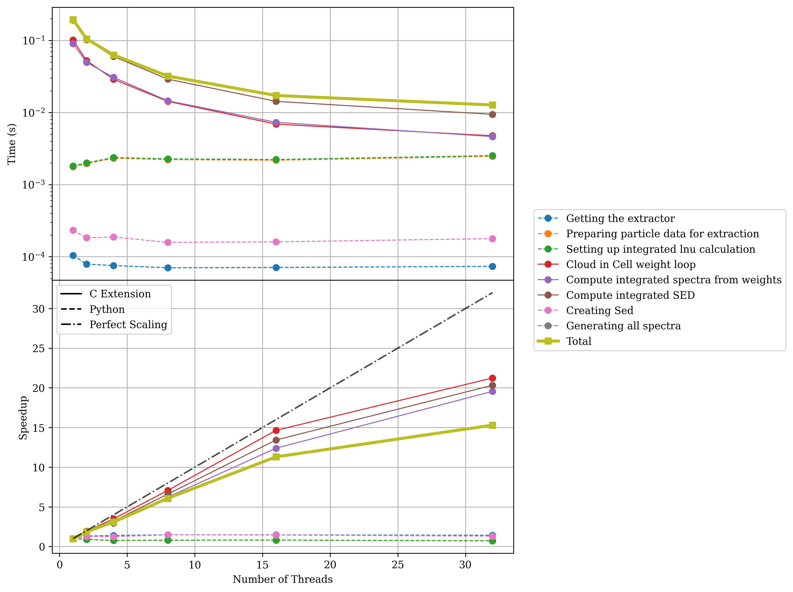
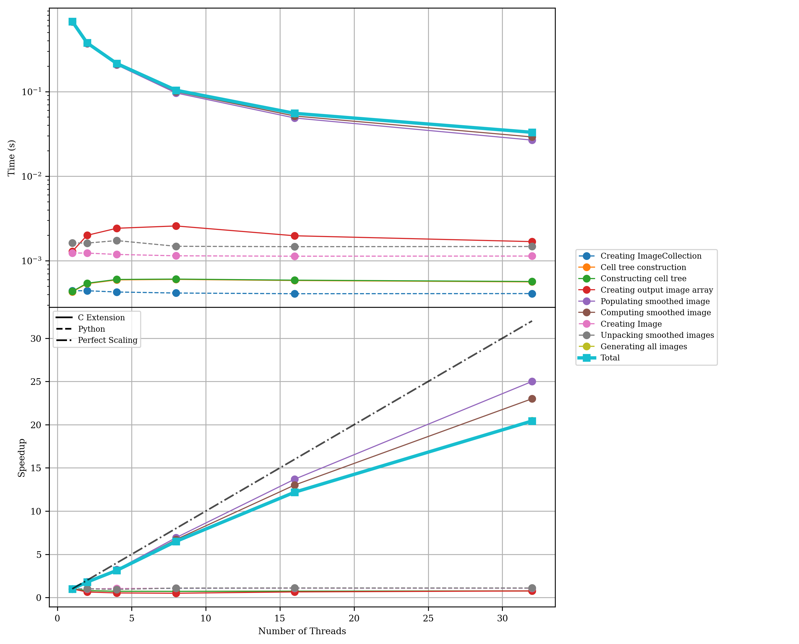

Strong Scaling (Thread Count)
==============================

Strong scaling tests measure how performance improves when using more threads on a **fixed problem size**. These benchmarks show the parallel efficiency of Synthesizer's OpenMP implementation for computationally intensive operations.

The performance should scale with the number of threads used, up to the number of physical cores on your machine. Beyond the physical core count, you may see diminishing returns due to hyperthreading overhead.

All tests were run on AMD EPYC 7542 32-Core Processor hardware with up to 32 threads.

Integrated Spectra Scaling
---------------------------

Generating integrated (galaxy-level) spectra from 1,000,000 stellar particles with varying thread counts.

.. code-block:: bash

    python strong_scaling_int_spectra.py --basename docs --nstars 1000000 \
        --max_threads=32 --average_over 10 --low_thresh 0.01

Particle Spectra Scaling
-------------------------

Generating per-particle spectra from 10,000 stellar particles with varying thread counts.

.. code-block:: bash

    python strong_scaling_part_spectra.py --basename docs --nstars 10000 \
        --max_threads=32 --average_over 10 --low_thresh 0.01

.. image:: plots/docs_part_spectra_cic_totThreads32_nstars10000.png
   :width: 75%
   :align: center

Line-Of-Sight (LOS) Column Density Scaling
-------------------------------------------

Computing LOS column densities for 1,000,000 star and 1,000,000 gas particles with varying thread counts.

.. code-block:: bash

    python strong_scaling_los_col_den.py --basename docs --nstars 1000000 \
        --ngas 1000000 --max_threads=32 --average_over 10 --low_thresh 0.01

.. image:: plots/docs_los_column_density_totThreads32_nstars1000000_ngas1000000.png
   :width: 75%
   :align: center

Smoothed Imaging Scaling
-------------------------

Generating smoothed images from 10,000 stellar particles with varying thread counts.

.. code-block:: bash

    python strong_scaling_images.py --basename docs --nstars 10000 \
        --max_threads=32 --average_over 10 --low_thresh 0.01

Considerations
--------------

**Ideal Strong Scaling**: With N threads, the runtime should be 1/N of the single-threaded time (i.e., perfect linear speedup). In practice, parallel overhead and serial portions of the code limit this ideal scaling.

**Practical Considerations**:

- **Physical cores matter**: Performance typically plateaus after using all physical cores
- **Hyperthreading**: Using more threads than physical cores may provide marginal improvements but can introduce overhead
- **Operation-dependent**: Different operations have different parallel efficiencies
  
  - Spectra generation: Excellent scaling (compute-bound, minimal communication)
  - LOS column density: Good scaling (some spatial dependency)
  - Imaging: Moderate scaling (depends on kernel complexity)

- **Memory bandwidth**: Very high thread counts may be limited by memory bandwidth rather than compute

**Recommended Thread Counts**:

For most use cases, use **4-8 threads** for good performance without excessive resource consumption. For dedicated analysis on HPC systems, you can use up to the number of **physical cores** (typically 16-64 on modern HPC nodes).

Profiling Scripts
-----------------

The strong scaling tests can be reproduced using the scripts in the `profiling/scaling directory <https://github.com/synthesizer-project/synthesizer/tree/main/profiling/scaling>`_. See the repository for the full set of strong scaling profiling scripts.
